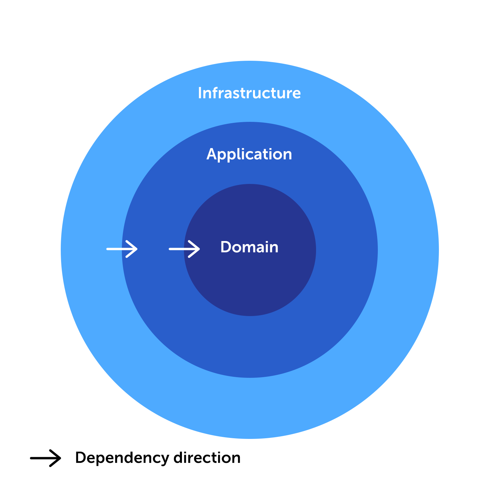

# [Layered Architecture Boilerplate using NodeJS and TypeScript](https://github.com/benedya/nodejs-layered-architecture)

[](https://github.com/benedya/nodejs-layered-architecture/blob/master/LICENSE)

Welcome to the **Layered (Clean) Architecture Example** built with NodeJS and TypeScript. This open-source project provides a comprehensive boilerplate showcasing a well-structured and maintainable architecture for your NodeJS applications.

## Table of Contents
- [Introduction](#introduction)
- [Architecture Overview](#architecture-overview)
- [Dependency Rules](#dependency-rules)
- [Controlling Dependencies](#controlling-dependencies)
- [Dependency Injection](#dependency-injection)
- [Examples](#examples)
- [Contributing](#contributing)
- [License](#license)

## Introduction
The primary objective of this project is to demonstrate how to create a scalable and modular application structure using the powerful concept of the **Layered Architecture**. The architecture encourages separation of concerns and provides a clear distinction between different layers of your application.

## Architecture Overview
The application follows the **Layered Architecture**, which consists of three main layers:

1. **Domain Layer**: This layer holds the core business logic of your application following the principles of Domain-Driven Design (DDD). It is independent of any other layer and contains entities, value objects, aggregates, and domain services.

2. **Application Layer**: The application layer houses the various features and use cases that your module offers. It depends on the Domain layer to execute business logic and operations.

3. **Infrastructure Layer**: The infrastructure layer contains implementations of interfaces defined in the inner layers. It deals with the technical aspects of your application, such as database access, external APIs, and other third-party integrations. This layer depends on both the Application and Domain layers.



## Dependency Rules
To maintain a clean and well-structured architecture, the following dependency rules are adhered to:

- **Domain Layer**: The core domain logic should not depend on any other layer, keeping it decoupled and reusable.

- **Application Layer**: The application layer can depend on the Domain layer to access and utilize domain logic to fulfill use cases.

- **Infrastructure Layer**: The infrastructure layer can depend on both the Application and Domain layers, allowing it to implement the interfaces defined in the inner layers.

## Controlling Dependencies
In order to enforce the defined dependency rules, the `eslint-plugin-boundaries` plugin is utilized. The rules are clearly described in the `.eslintrc.js` file, ensuring that the architecture stays consistent and clean.

## Dependency Injection
**InversifyJS** is leveraged to configure and manage dependencies across the application. InversifyJS provides a powerful inversion of control container, making it easy to handle the injection of dependencies and manage the application's lifecycle effectively.

## Examples
A module's use cases (from the Application layer) can be used in commands, controllers, etc.

```typescript
import { container } from './inversify.config';
import { CreateUserUseCase } from './Module/User/Application/CreateUserUseCase';

const email = 'user@test.com';
const crateUserUseCase = container.get(CreateUserUseCase);

const user = await crateUserUseCase.createUser(email);

```

Feel free to explore the different layers and modules of the application to understand how the architecture comes together.

## Contributing
Contributions to improve and expand this project are welcome. If there are any ideas, bug fixes, or enhancements, feel free to open an issue or submit a pull request. Collaboration is encouraged to create an even better example of the Layered Architecture!

## License
This project is licensed under the MIT License - see the [LICENSE](LICENSE) file for details.

---

It is hoped that this example helps in building robust and scalable applications using the power of Layered Architecture. Happy coding! If there are any questions or assistance is needed, please don't hesitate to reach out.

